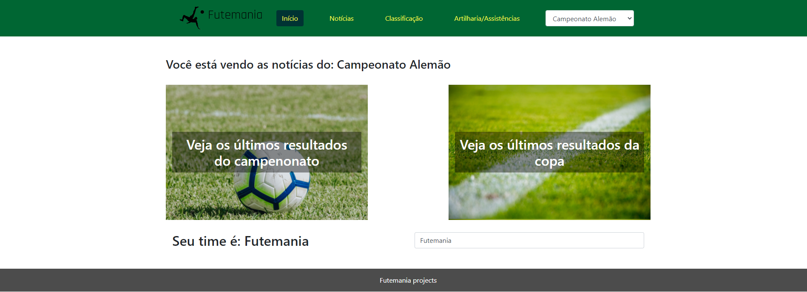
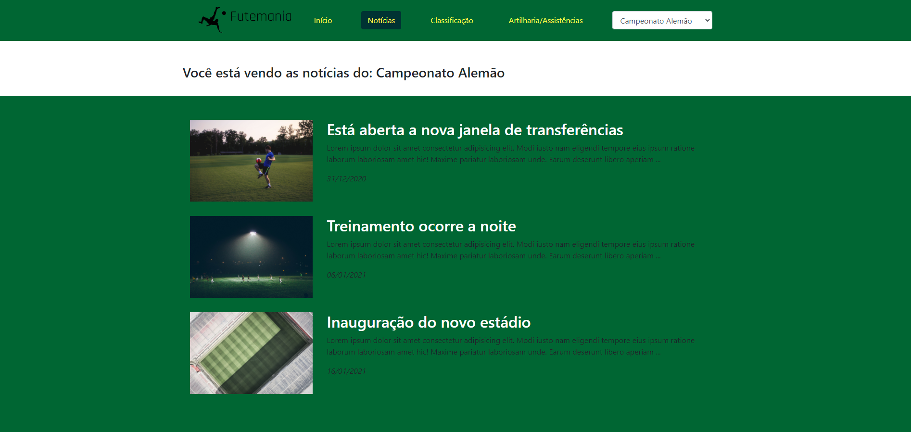
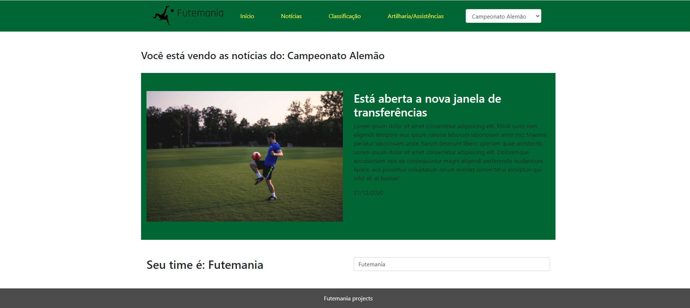

# Futemania

This project is a portal for news and sports results!

## Frontend
Developed in Vue.js

The website coming soon!

## Routes
The project has 3 routes:
### Home


### News


### Detail news



## How to install 

On terminal, clone the project: 

```
git clone https://github.com/LeonardoSalmento/Futemania-web.git
```

get in the folder project:

```
cd Futemania-web
```

Install dependencies:
```
yarn
```
or 

```
npm install
```

Compiles and hot-reloads for development
```
npm run serve
```
